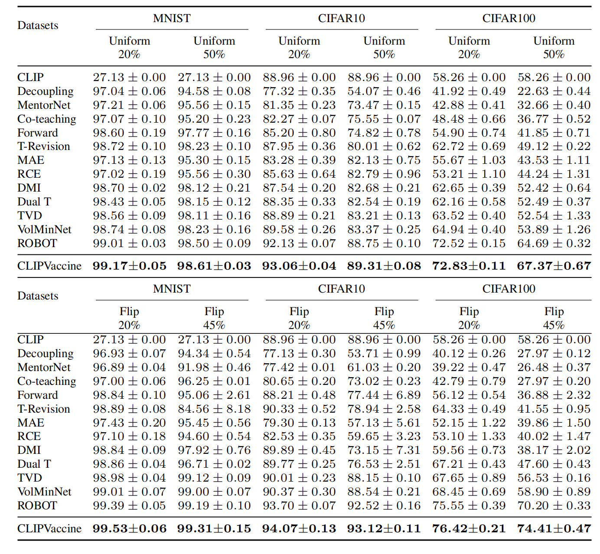

# CLIPVaccine: Mitigating Representation Distortion for Label Noise Learning
This repository contains the source code for the paper CLIPVaccine: Mitigating Representation Distortion for Label Noise Learning.
## Table of Contents  
- [Installation](#Installation)
- [Reproducing Results](#Reproducing-Results)
## Installation
To use this project, you will need to create the following environment:
- python 3.8
- Pytorch: `conda install pytorch==1.13.1 torchvision==0.14.1 torchaudio==0.13.1 pytorch-cuda=11.6 -c pytorch -c nvidia`
- CLIP:
  1. `pip install ftfy regex tqdm packaging`   
  2. Download `CLIPZIP.zip`, and put the decompressed `clip`, a python package, into your environment to run the examples we provide.
## Reproducing Results
To reproduce the results from our paper, train the model by running the following commands:
```
#cifar10 experiment with uniform and flip noises
python CLIPVaccine_main.py --dataset CIFAR10 --network r18 --corruption_type Uniform --corruption_ratio 0.50 --batch_size 128 --max_epoch 50  --classes 10 --estimator_interval 3 
python CLIPVaccine_main.py --dataset CIFAR10 --network r18 --corruption_type Flip --corruption_ratio 0.45 --batch_size 128 --max_epoch 90 --classes 10 --estimator_interval 3 --optimizer SGD
cifar100 experiment with uniform and flip noises
python CLIPVaccine_main.py --dataset CIFAR100 --network r34 --corruption_type Uniform --corruption_ratio 0.50 --batch_size 128 --max_epoch 60  --classes 100 --estimator_interval 3
python CLIPVaccine_main.py --dataset CIFAR100 --network r34 --corruption_type Flip --corruption_ratio 0.45 --batch_size 128 --max_epoch 200 --classes 100 --estimator_interval 3 --optimizer SGD
```
Tips: During the first run, it will take some time to download the dataset and generate offline CLIP feature representations. For subsequent runs, you can add command `--data_list_exist` to avoid the overhead of regenerating offline CLIP feature representations.
## Example Results


